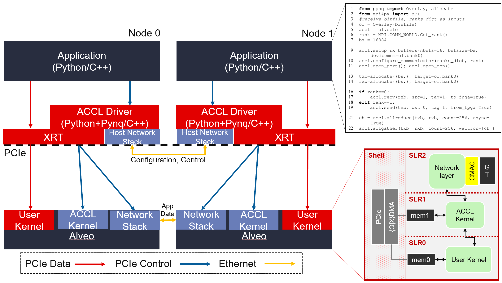

# ACCL: the Adaptive Collective Communication Library

ACCL (pronounced like [Achill](https://goo.gl/maps/4e3vGfa5BsT5s3vm9), the Irish island) is a MPI-like communication library designed for the needs of FPGA-accelerated applications. Similar to NVidia's [NCCL](https://github.com/NVIDIA/nccl) and AMD's [RCCL](https://github.com/ROCmSoftwarePlatform/rccl), ACCL provides a small but highly FPGA-optimized subset of MPI collectives. With ACCL, applications can move data directly between FPGA local memories, utilizing the 100 Gbps Ethernet ports on Alveo FPGA accelerator cards, and avoiding copies to host memory or transfers over host NICs. This makes it similar to Nvidia GPUDirect, except with ACCL a single card serves for both networking and compute.

## Why MPI, and how much of it?

The Message Passing Interface ([MPI](http://mpi-forum.org/)), is a standardized and portable message-passing system designed to function on a wide variety of parallel computers. Its wide availability, universal support and high performance make it the lingua franca of distributed computing and a natural API to follow when implementing specialized distributed computation frameworks such as ACCL. ACCL implements the `send` and `recv` MPI primitives and seven of the most common collectives: `broadcast`, `gather`, `allgather`, `scatter`, `reduce-scatter`, `reduce`, and `allreduce`.

## ACCL System-Level View

The concepts underpinning ACCL are illustrated in the figure below. In this example, two nodes communicate with ACCL. The user application makes compute calls via the Xilinx Run-Time (XRT) to user-defined compute kernels in the FPGA fabric. The application also makes communication calls, using the [ACCL API](./api.md) to move data between nodes. These MPI-like calls get interpreted by the ACCL driver which issues commands to communication specific kernels in the FPGA, described in the [Hardware](./kernel.md) Page. Some data may be exchanged between nodes utilizing the host network, typically for initial set-up of the application and ACCL driver, but all data submitted to ACCL communication calls gets transferred directly between the Alveo cards via the embedded 100 Gbps Ethernet ports. With ACCL, the host remains mostly idle during application execution as the communication and computation are performed entirely in the FPGA, reducing latency. 

