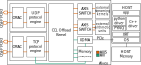
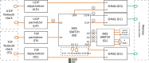
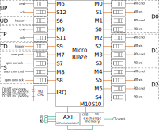

# ACCL Under the Hood

ACCL is a combination of software running on the host CPU, FPGA data-moving hardware, and control firmware executing on a FPGA-embedded microcontroller. Here is a high level overview of the ACCL structure:



In the FPGA, ACCL features a collectives offload engine (CCLO) and one or more network protocol offload engines (POE), each of which is implemented as a stand-alone Vitis kernel. The CCLO implements the collectives on top of TCP or UDP. The protocol offload engines implements the full network stack up to UDP and TCP respectively and connect directly to Ethernet ports, e.g. through Alveo Gigabit Transceivers and QSFP28 ports. For TCP, the protocol offload kernel requires access to external memory to reorder incoming packets. The host communicates with the CCLO over PCIe and Xilinx XDMA, but this complexity is hidden by XRT and our drivers. The distributed application that runs on, possibly multiple, hosts leverages the ACCL Python or C++ driver to control the CCLO.

## The CCLO Kernel

The CCL Offload (CCLO) kernel implements all the ACCL primitives and collectives by orchestrating data movement between the network fabric, FPGA external memory, and FPGA compute kernels, with no host CPU involvement. Data movement to and from the network is accomplished through custom interface blocks to the TCP/UDP network protocol offload engines, while FPGA external memory (DDR or HBM) is read and written through DataMover engines (DMA).

Each ACCL call typically requires multiple transfers in specific sequences between ranks to achieve the desired result. Orchestrating the required transfers and the interaction between various subsystems at high speed is a challenge. For this reason, the CCLO kernel consists of two subsystems: a software-programmable control plane which is extremely flexible, and a high-throughput data plane consisting of DMAs, configurable routing, and pipelined arithmetic, which is fast.

### CCLO Data Plane

The image below presents a high level overview of the CCLO data plane structure which consists of multiple functional units (FUs) - three  AXI DataMover engines (DMA0, DMA1, DMA2), AXI Stream (AXIS) interconnects (e.g. S0, S1), an internal arithmetic unit (A0) and network interface logic (UD, UP, TP, TD). Data flows through all those components via 512 bit wide AXIS interfaces connected together via the central AXIS Switch. 

AXI DataMover engines (DMA) transfer between AXI memory mapped (AXIMM) and AXI stream (AXIS) domains. Each DMA provides two channels dedicated to read (memory to stream) and write (stream to memory) operations respectively. Each of the channels is independently controlled through a pair of AXI Streams, carrying DMA commands and command acknowledgements respectively.  



The communication with POEs is accomplished by means of custom HLS blocks - for each protocol, one packetizer and one depacketizer. The packetizers (UP, TP) are responsible for inserting the ACCL message header into the stream, dividing up the stream into individual packets of pre-set lengths, and forwarding the packet to the respective protocol offload kernel. The depacketizers (UD, TD) perform the reverse operation. 

The AXIS Switch (S0) provides a flexible interconnection in the data plane. S0 is programmable via AXI-mapped registers to implement any connectivity pattern between its inputs and outputs. Therefore, most data plane components are not arranged in a fixed datapath but rather the order in which data traverses different components is set at run-time by the control firmware.

### CCLO Control Plane

The control plane is shown below. Central to the control plane is a MicroBlaze (uB) processor. Firmware executing on the Microblaze generates commands to the various data plane blocks - the DMAs, (de)packetizers, switch, etc to assemble collectives. By implementing the control in uB (compiled from C code), the control logic can run at fairly high frequencies (up to 250 MHz) and can also be adapted and improved over time with relative ease, without requiring re-synthesis of the CCLO kernel. To minimize latency we employed a pipelined control plane architecture whereby most functional blocks are controlled through hardware FIFOs, decoupling control issuing from the execution. Less performance-sensitive blocks (AXI Stream switches, arithmetic) are controlled through an AXI bus using register-mapped interfaces.



Interaction with the host is achieved through a call controller and shared mailbox memory (exchange memory module), which are accessible by both the uB and the host. The call controller is an HLS IP which implements the ap_ctrl_hs host-facing handshake protocol allowing the CCLO to appear to the Xilinx Run-Time (XRT) as a call-able Vitis kernel. The 4KB mailbox memory is accessible by both the host and Microblaze and enables large and stable configuration parameters to be set by the host and used by the firmware. 

## Kernel Hardware Interfaces

The following table reports the CCLO kernel interfaces and their main parameters. For details about POE interfaces, refer to the TCP POE and UDP POE respective documentation. 

Port Name     | Port Type  | Range | Width   | Description
-----         |------      |-------|-------- | ------------  
s_axi_control | AXI-Lite   | 8 KB  | 32      | Host interface into CCLO   
m_axi_\[0\|1\|2\] | AXI-MM     | 16 EB | 512     | DMA interfaces
\[s\|m\]\_axis_arith\_\[res\|op\]  | AXI-Streams | N/A   | 512/1024     | External arithmetic interface
\[s\|m\]_axis_krnl			        | AXI-Streams | N/A | 512 | User kernel stream attachment
\[s\|m\]_axis_compression\[0\|1\|2\]	| AXI-Streams | N/A | 512 | Compression lanes
\[s\|m\]_axis_udp\_* | AXI-Streams | N/A   | 512     | UDP POE interface
\[s\|m\]_axis_tcp\_* | AXI-Streams | N/A | Various Widths | TCP POE interface

Some of these interfaces are not essential for CCLO operation but provide extra functionality. For example, attaching reduction arithmetic logic to the `_arith_` streams provides the capability for the CCLO to perform reduction based collectives. Similarly, the compression lanes allow compressors and decompressors to be attached, providing compressed collective support. Finally, the `_krnl` streams enable a direct connection to a streaming user kernel, allowing ACCL to send/receive directly from/to a kernel with minimal latency. If any of these interface are not utilized, they should be connected in loop-back.

The arithmetic and compression interfaces also carry TDEST on the AXI-Stream master. This allows multiple arithmetic and (de)compression blocks to be attached to these interfaces through the use of a AXI-Stream switch with TDEST routing. For these interfaces, the CCLO kernel expects data to loop back if TDEST is set to zero, so the switch must be configured accordingly.

## Kernel Register and Configuration Space

The CCLO communicate with the host through a 8kB IO space which is visible through the `s_axi_control` port and which allows the software to configure and start the CCLO. The IO space is divided into two sections:

IO section  | Range | Description
----------------|--------|------------
Control and Arguments | 0x0 - 0x70 | Registers for starting ACCL calls
Reserved         |0x74 - 0x7FF | Unmapped space
Configuration |0x800 - 0xFF4 | Host-managed configuration space
Status | 0xFF8 - 0xFFF | ID code and error status of the core

The control and argument register space is physically implemented as fixed-function registers in the CLO with a HLS IP whose sole purpose is to gather call parameters, forward them to the uB, wait for completion signalling from the uB, and signal completion to the driver through the `ap_ctrl_hs` protocol. The configuration space is mapped into both the host and uB memory spaces, starting at 0x1000. In this area, the driver writes specifications for various data structures the CCLO needs for operation. The data structures which need to be configured are:

- RX buffers configuration, specifying details of buffers available for temporary storage of data during collective execution
- Communicator configuration, describing the nodes involved in communication (IP addresses, ports, etc)
- Miscellaneous section, from address (0x0FF8 to 0x0FFF)

### Kernel Control, Parameter, and Status Registers
------

High-level calls to the ACCL API get translated by the ACCL driver into writes to this part of the register space. Some of the registers have a direct mapping to API function parameters.

Register name  | Offset | Description
----------------|--------|------------
control | 0x0 | Control register with `ap_ctrl_hs` fields
Reserved | 0x4-0x10 | Unused registers. Do not write
call_type      |0x010   | Specifies which primitive, collective, or housekeeping function the user wants to execute     
count     |0x018   | Corresponds to the count argument of the software function, when it exists     
comm_addr      |0x020   | Address of the communicator specification in the exchange memory     
root_src_dst   |0x028   | One of root, source rank, or destination rank, depending on which function is being called     
function       |0x030   | Selects reduction or housekeeping function     
tag            |0x038   | Message tag where appropriate     
arcfg_addr      |0x040   | Address to the pipeline arithmetic specification     
compression_flags      |0x048   | Indicates which of the buffer arguments are compressed, and if Ethernet transmission should be compressed    
stream_flags      |0x050   | Indicates whether to use the direct stream attachment instead of any of the buffer arguments     
buf0_ptr_addrl |0x058   | LSB of addr_0, if in use
buf0_ptr_addrh |0x05C   | MSB of addr_0, if in use
buf1_ptr_addrh |0x064   | LSB of addr_1, if in use
buf1_ptr_addrl |0x068   | MSB of addr_1, if in use
buf2_ptr_addrl |0x070   | LSB of addr_2, if in use
buf2_ptr_addrh |0x074   | MSB of addr_2, if in use
buf2_ptr_addrh |0x074   | MSB of addr_2, if in use
hw_id | 0xFF8 | 32-bit ID code identifying the hardware version
errval | 0xFFC | 32-bit error code

The `call_type` register values encode which function of the ACCL API the CCLO will execute. The encoding is:
````
config          : 0
copy            : 1
combine         : 2
send            : 3
recv            : 4
bcast           : 5
scatter         : 6
gather          : 7
reduce          : 8
allgather       : 9
allreduce       : 10
reduce_scatter  : 11
ext_stream_krnl : 12
nop             : 255
````

### RX Spare Buffer Configuration Space
  -------
The CCLO utilizes staging areas in external memory, called `RX spare buffers`, to keep data received from the network that the user has not yet claimed. These spare buffers are configured in an area of the register space starting at BASEADDR+0x800.

The RX spare buffer configuration space consists of:
  - one 32-bit integer (`rx_buffer_count` from now on) containing the number of RX buffers available for the CCLO to use.
  - `rx_buffer_count` buffer definitions. Each buffer is defined by the following struct:

    ````
    typedef struct {
      unsigned int addrl;
      unsigned int addrh;
      unsigned int max_len;
      unsigned int dma_tag;
      unsigned int status;
      unsigned int rx_tag;
      unsigned int rx_len;
      unsigned int rx_src;
      unsigned int sequence_number;
    } rx_buffer;
    #define STATUS_IDLE     0x00
    #define STATUS_ENQUEUED 0x01
    #define STATUS_RESERVED 0x02
    #define STATUS_ERROR    0x04
    ````

 The spare buffer address in external memory is defined by `addrl` and `addrh` and its size defined by `max_len`. The CCLO is free to use less than `max_len`. These three fields are set by the ACCL driver. All other fields are populated by the CCLO. The status field identifies whether the buffer is unused (IDLE), ready (ENQUEUED), in use (RESERVED), or has encountered some error. The remaining fields store metadata received alongside the stored data.
  
 The RX buffers are all the storage available to the CCLO. Thus, during operation the total size of outstanding messages (sent but not yet received) should not exceed the total size of the spare buffers. In case this happens, the POEs will drop packets, resulting in throughput degradation for TCP and data loss for UDP.

### Communicators
-------
A communicator defines the participants to a collective operation, called ranks, and identifies the local node. The communicator definition has the following structure:
  - number of ranks (``world_size``);
  - local rank, an index ( <= ``world_size`` -1 ) that indicates one of the entry in list of rank descriptors
  - an array of ``world_size `` rank descriptors. Each descriptor consists of rank IP, rank port, session ID for the connection to that rank (TCP only), inbound and outbound sequence numbers (for CCLO internal use)

Multiple communicators can be defined in the configuration IO space. The address of the communicator to be used is provided as an argument to the function calls.
